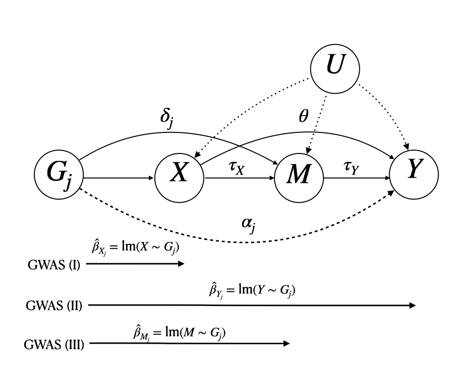

# MAGIC

Mediation analysis is a powerful tool for studying causal pathways between exposure, mediator, and outcome variables of interest. While classical mediation analysis using observational data often requires strong and sometimes unrealistic assumptions, such as unconfoundedness, Mendelian Randomization (MR) avoids unmeasured confounding bias by employing genetic variants as instrumental variables. We develop a novel MR framework for mediation analysis (called MAGIC) with
genome-wide associate study (GWAS) summary data, and provide solid statistical guarantees. Our framework efficiently integrates information stored in three independent GWAS summary data and mitigates the commonly encountered winner’s curse and measurement error bias (a.k.a. instrument selection and weak instrument bias) in MR. As a result, our framework provides valid statistical inference for both direct and mediation effects with enhanced statistical efficiency. As part of this endeavor, we also demonstrate that the concept of winner’s curse bias in mediation analysis with MR and summary data is more complex than previously documented in the classical two-sample MR literature, requiring special treatments to address such a bias issue.  We illustrate the finite-sample performance of our approach through simulation experiments and a case study.

Please cite the following manuscript when using MAGIC or any codes listed in this repo:
~~~
Lyu, R. Q., Wu, C., Ma, X., and Wang, J. (2023+). Mediation Analysis with Mendelian Randomization and Efficient Multiple GWAS Integration. Submitted.
~~~

In this repo, we provide the following sources.

- Simulation folder: the codes for replicating simulation results in the above manuscript
- Real Data Analysis folder: the codes for replicating real data results in the above manuscript

We provide an R package [MR.Rerand](https://github.com/LQRrrrr/MR.Rerand) to implement (i) RIVW for estimating the causal effect $\beta$ from the exposure variable $X$ to the outcome variable $Y$, (ii)MAGIC for estimating the direct effects $\theta$ and $\tau_Y$, the mediation effect $\tau=\tau_X\tau_Y$, the causal effect $\tau_X$ from $X$ to $M$, and the total effect $\theta+\tau$ as parameters shown in the below figure.. The users may need to specify the working directory and install relevant packages to run it smoothly.

<figure>
  
  <figcaption>Causal Diagram for Mediation Analysis.</figcaption>
</figure>
